======================================
Sigma-X Engine Visualize Intersections
======================================

utdf2gmns provides an optional method to generate Sigma-X visualizations for
signalized intersections. The workflow requires desktop Microsoft Excel and
is supported only on Windows and macOS.

Install the optional dependency before running the workflow:

.. code-block:: console

    python -m pip install "utdf2gmns[sigma-x]"

Then run:

.. code-block:: python
    :linenos:

    import utdf2gmns as ug

    if __name__ == "__main__":
        path_utdf = "datasets/data_bullhead_seg4/UTDF.csv"

        net = ug.UTDF2GMNS(utdf_filename=path_utdf, verbose=False)
        success = net.utdf_to_gmns_signal_ints()

By default, generated files are saved in an utdf_to_gmns_signal_ints
subdirectory beside the input UTDF file. On unsupported platforms, the method
does not launch Excel and returns False.

Signalized Intersection Overview Chart
======================================
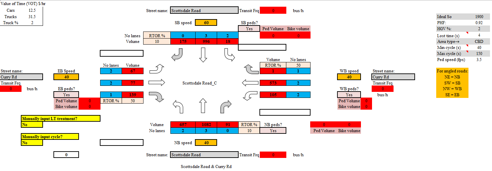

Phasing Chart / Table
=====================

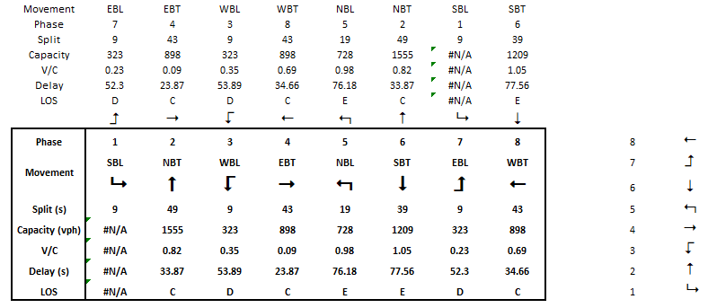

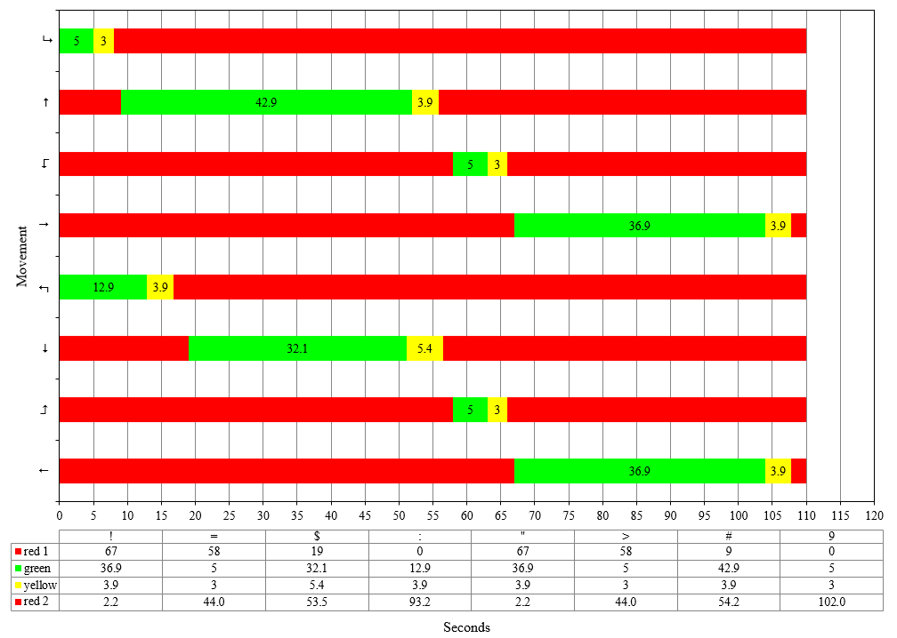

Turning Volumes (VPH) Chart
===========================

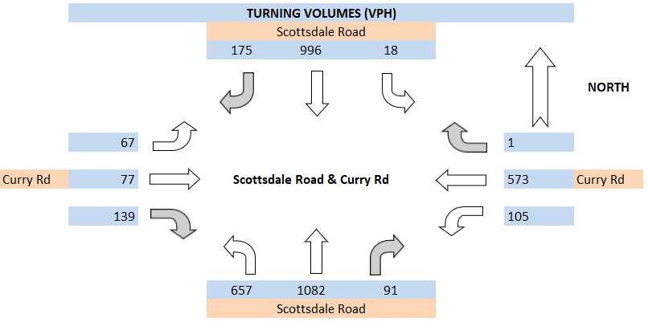

Phase Designation (Phase No) Chart
==================================

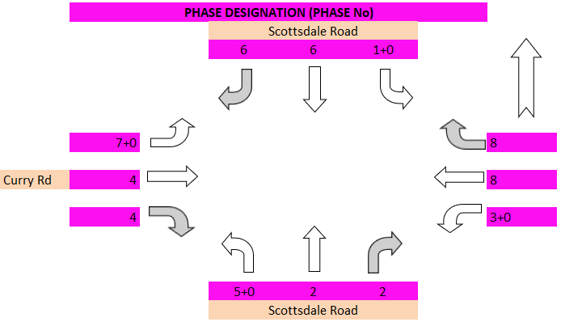

Number of Lanes Chart
=====================

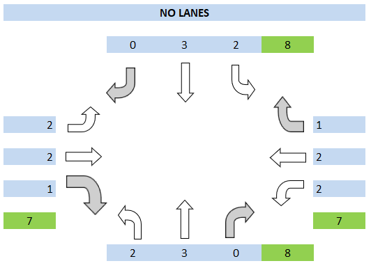

Split Durations (Seconds) Chart
===============================

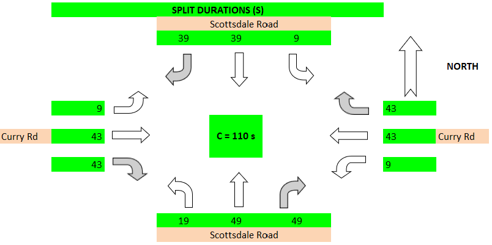

Movement Capacity (VPH) Chart
=============================

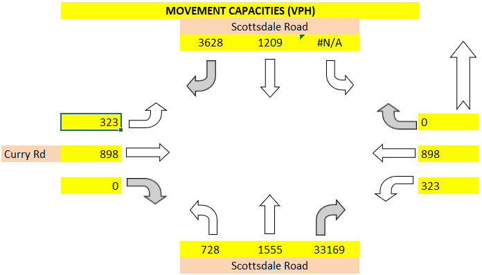

V/C Ratio Chart
===============

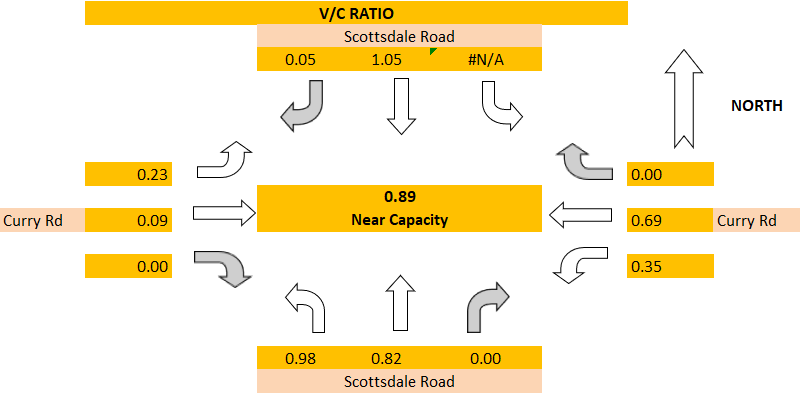

Control Delay (Seconds) Chart
=============================

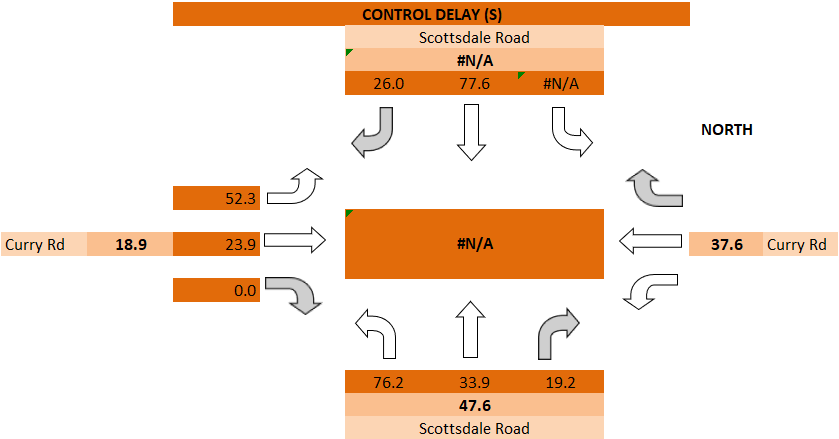

Intersection Level of Service (LOS) Chart
=========================================

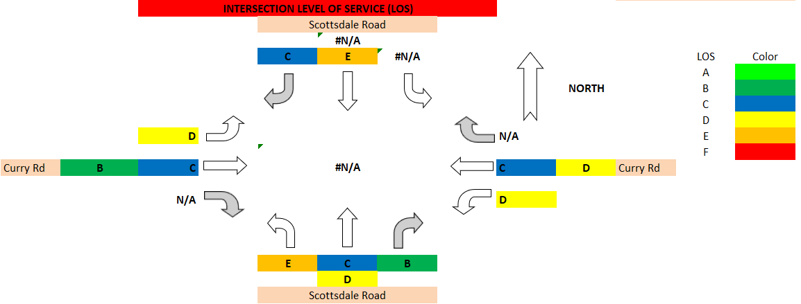
