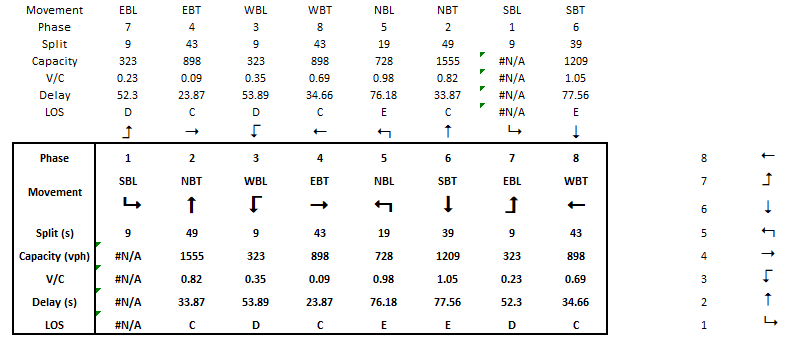
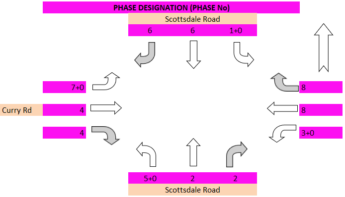

======================================
Sigma-x Engine Visualize Intersections
======================================

`utdf2gmns` package provides a method to visualize intersections using the Sigma-x engine. This is an optional step and can be used to generate a visual representation of the intersections.

.. code-block:: python
    :linenos:
    :emphasize-lines: 6, 9

    import utdf2gmns as ug

        if __name__ == "__main__":

            path_utdf = r"datasets\data_bullhead_seg4\UTDF.csv"

            # Step 1: Initialize the UTDF2GMNS
            net = ug.UTDF2GMNS(utdf_filename=path_utdf, verbose=False)

            net.utdf_to_gmns_signal_ints()  # This will generate the Sigma-x engine visualization for intersections

This will save visualization file for each intersection in the current working directory. You can open these files to perform additional analysis.

Signalized Intersection Overview Chart
======================================
.. image:: ../_static/int_overview.png
    :width: 600
    :alt: Signalized Intersection Overview Chart

Phasing Chart / Table
=====================

Turning Volumes (VPH) Chart
===========================

Phase Designation (Phase No) Chart
==================================

Number of Lanes Chart
=====================

.. image:: ../_static/int_num_lanes.png
    :width: 600
    :alt: Number of Lanes Chart

Split Durations (Seconds) Chart
===============================

Movement Capacity (VPH) Chart
=============================

V/C Ratio Chart
===============

.. image:: ../_static/int_v_c_ratio.png
    :width: 600
    :alt: V/C Ratio Chart

Control Delay (Seconds) Chart
=============================

Intersection Level of Service (LOS) Chart
=========================================

.. image:: ../_static/int_level_of_service.png
    :width: 600
    :alt: Intersection Level of Service (LOS) Chart
