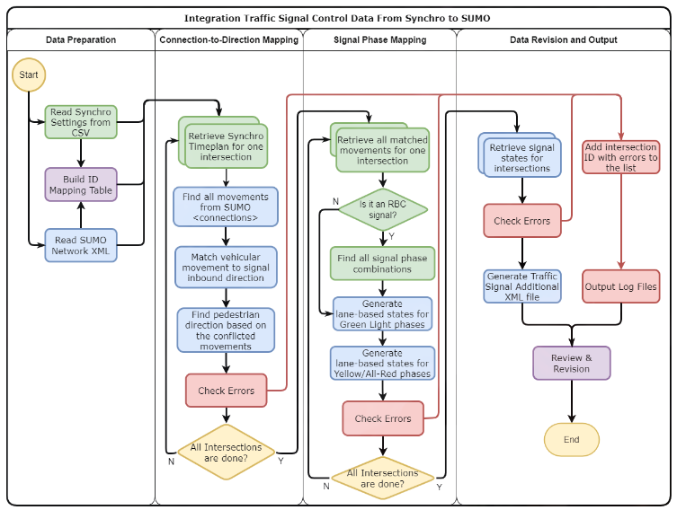

===================
Signal Conversation
===================

.. note::
    - Convert UTDF signal to GMNS and then to SUMO and other simulators.
    - The original signal conversation from the paper: `Integration Traffic Signal Control From Synchro to SUMO <https://www.tib-op.org/ojs/index.php/scp/article/view/1112>`_
    - This package combined the original signal conversation method (fixed bugs for larger and complex network) with the GMNS format to support more traffic simulation platforms, such as SUMO, etc.

The overall signal conversation process in the `utdf2gmns` package involves the following framework (`source <https://www.tib-op.org/ojs/index.php/scp/article/view/1112>`_):

In orger to view the extracted signal from UTDF data, you can use the `create_signal_control` method in the `UTDF2GMNS` class. This will generate signals from each intersection.

.. code-block:: python
    :linenos:
    :emphasize-lines: 9, 12

    import utdf2gmns as ug

    if __name__ == "__main__":

        region_name = " Bullhead City, AZ"
        path_utdf = r"datasets\data_bullhead_seg4\UTDF.csv"

        net = ug.UTDF2GMNS(utdf_filename=path_utdf, region_name=region_name, verbose=False)
        net.create_signal_control()

        # you can view the singal info
        net.netowrk_signal_control
