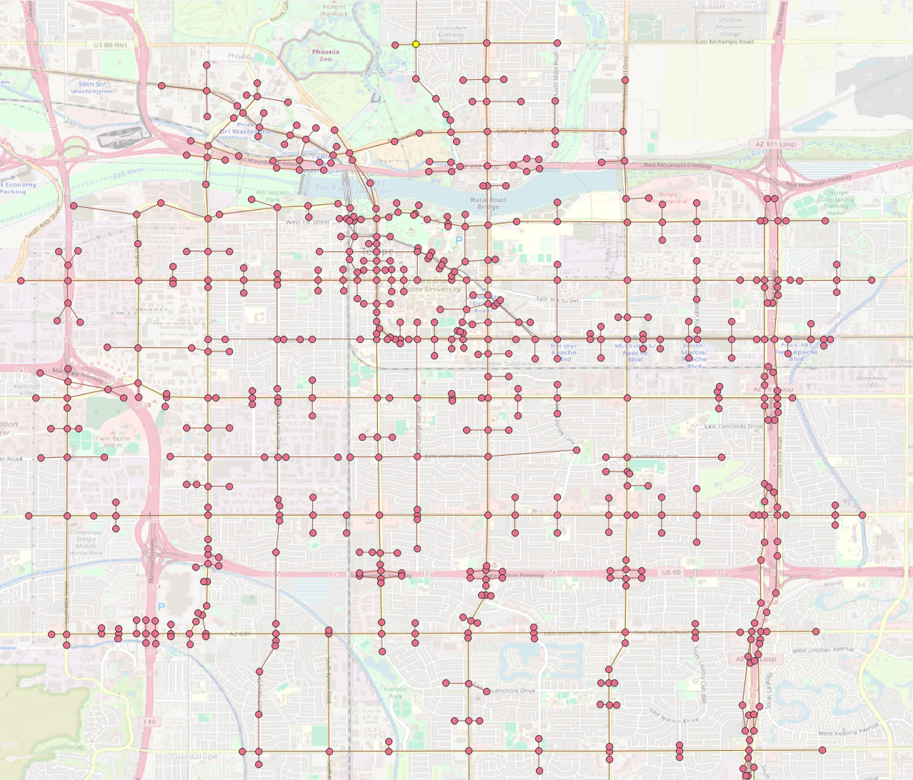

===================
UTDF To GMNS Format
===================

Convert UTDF files to GMNS format.
This script converts UTDF files to GMNS format. It reads the UTDF file, extracts the relevant data, and writes it to GMNS format files.
The resulting GMNS files are saved in the same directory as the input UTDF file.

    - node.csv

    - link.csv

    - signal.json

    - utdf_nodes.csv

    - utdf_links.csv

    - utdf_lanes.csv

    - utdf_network.csv

    - utdf_phases.csv

    - utdf_timeplans.csv

GMNS Link Generation
====================
There are two ways to generate GMNS links from UTDF files:

1. **Create Link Line**

   - This method creates a link line from the UTDF file. It uses the coordinates of the nodes in the UTDF file to create a line that represents the link.
   - The resulting link line is saved in the GMNS format.

2. **Create Link Polygon**

   - This method creates a link polygon from the UTDF file. It uses the coordinates of the nodes and number of lanes in each link to create a polygon that represents the link (`With multiple lanes for each direction`).

Create Link Line
~~~~~~~~~~~~~~~~

.. code-block:: python
    :linenos:
    :emphasize-lines: 12

    import utdf2gmns as ug

    if __name__ == "__main__":

        region_name = " Bullhead City, AZ"
        path_utdf = r"datasets\data_bullhead_seg4\UTDF.csv"

        net = ug.UTDF2GMNS(utdf_filename=path_utdf, region_name=region_name, verbose=False)

        net.geocode_utdf_intersections(single_intersection_coord={}, dist_threshold=0.01)

        net.create_gmns_links(is_link_polygon=False)

Create Link Polygon
~~~~~~~~~~~~~~~~~~~
.. code-block:: python
    :linenos:
    :emphasize-lines: 12

    import utdf2gmns as ug

    if __name__ == "__main__":

        region_name = " Bullhead City, AZ"
        path_utdf = r"datasets\data_bullhead_seg4\UTDF.csv"

        net = ug.UTDF2GMNS(utdf_filename=path_utdf, region_name=region_name, verbose=False)

        net.geocode_utdf_intersections(single_intersection_coord={}, dist_threshold=0.01)

        net.create_gmns_links(is_link_polygon=True)

UTDF To GMNS
============
.. code-block:: python
    :linenos:
    :emphasize-lines: 14

    import utdf2gmns as ug

    if __name__ == "__main__":

        region_name = " Bullhead City, AZ"
        path_utdf = r"datasets\data_bullhead_seg4\UTDF.csv"

        net = ug.UTDF2GMNS(utdf_filename=path_utdf, region_name=region_name, verbose=False)

        net.geocode_utdf_intersections(single_intersection_coord={}, dist_threshold=0.01)

        net.create_gmns_links(is_link_polygon=False)

        net.utdf_to_gmns(incl_utdf=True)

The resulting GMNS network can be opened in QGIS, ArcGIS or any other GIS software that supports GMNS format (Below: example nodes and links).

